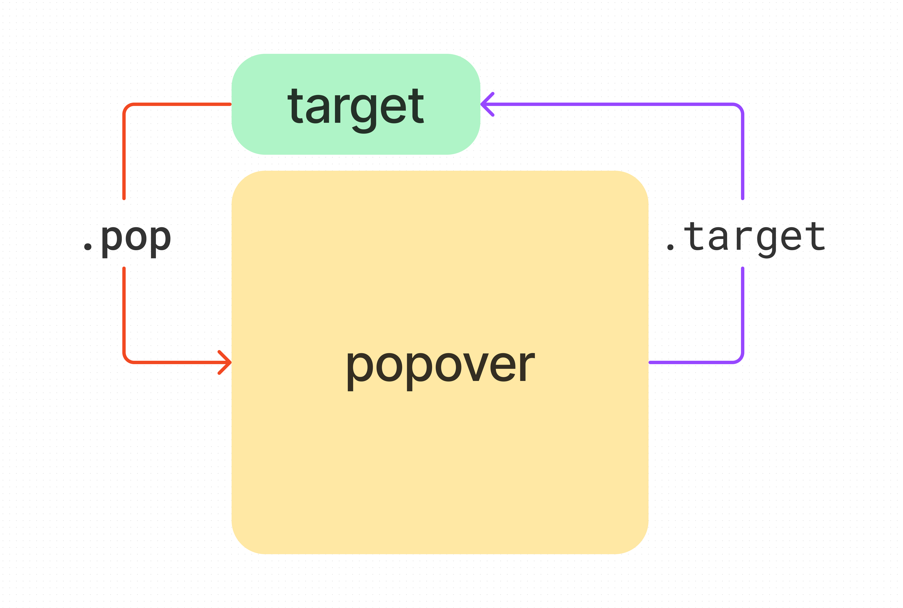

<script setup>
import { reactive, onMounted } from 'vue'
import './index.css'
  onMounted(() => {
    import('../../components/switch/')
    import('../../components/button/')
    import('../../components/popover/')
    popover_event.addEventListener('show',function(ev){
        console.log('悬浮层出现了');
    })
    popover_event.addEventListener('hide',function(ev){
        console.log('悬浮层消失了');
    })
  })
</script>

# popover

悬浮提示（操作）框。

## 使用方式

```html
<!-- 引入 -->
<script type="module">
    import '../components/popover/index.js';
</script>
<!-- 使用 -->
<xy-button>pop confirm</xy-button>
<xy-popover>
    <!-- dom -->
    <div>自定义内容</div>
</xy-popover>
```

需要将悬浮内容放入`<xy-popover></xy-popover>`内

## 类型`type`

提供两种默认样式，默认是带指向箭头的，同 [tips](./tips)，如果需要自定义，可以使用`custom`

<div class="wrap">
<xy-button type="primary">default</xy-button>
<xy-popover trigger="hover,focus">
    <xy-button type="flat">菜单一</xy-button>
    <xy-button type="flat">菜单二</xy-button>
    <xy-button type="flat">菜单三</xy-button>
</xy-popover>

<xy-button type="primary">custom</xy-button>
<xy-popover type="custom" trigger="hover,focus">
    <xy-button type="flat">菜单一</xy-button>
    <xy-button type="flat">菜单二</xy-button>
    <xy-button type="flat">菜单三</xy-button>
</xy-popover>
</div>

```html
<xy-button>default</xy-button>
<xy-popover>
    <xy-button type="flat">菜单一</xy-button>
    <xy-button type="flat">菜单二</xy-button>
    <xy-button type="flat">菜单三</xy-button>
</xy-popover>

<xy-button>custom</xy-button>
<xy-popover type="custom">
    <xy-button type="flat">菜单一</xy-button>
    <xy-button type="flat">菜单二</xy-button>
    <xy-button type="flat">菜单三</xy-button>
</xy-popover>
```

## 触发目标元素`target`

默认情况下，`xy-popover`是由**相邻的前一个节点**（`previousElementSibling`）控制的。如果需要自定义，可以通过`target`来选择，值为合法的选择器，比如`#id`、`.class`等

<div class="wrap">
  <xy-button type="primary" id="t1">target1</xy-button>
  <xy-button type="primary" id="t2">target2</xy-button>
</div>
<xy-popover target="#t1" trigger="hover,focus">
    我是 target1 触发的
</xy-popover>
<xy-popover target="#t2" trigger="hover,focus">
    我是 target2 触发的
</xy-popover>

```html
<xy-button id="t1">target1</xy-button>
<xy-button id="t2">target2</xy-button>
<xy-popover target="#t1">
    我是 target1 触发的
</xy-popover>
<xy-popover target="#t2">
    我是 target2 触发的
</xy-popover>
```

也可以指定多个`.class`，这样可以通过多个`target`来控制同一个悬浮层

<div class="wrap">
  <xy-button type="primary" class="target">target1</xy-button>
  <xy-button type="primary"  class="target">target2</xy-button>
  <xy-button type="primary"  class="target">target3</xy-button>
</div>
<xy-popover target=".target" trigger="hover,focus">
    我是 .target 触发的
</xy-popover>

```html
<xy-button class="target">target1</xy-button>
<xy-button class="target">target2</xy-button>
<xy-button class="target">target3</xy-button>
<xy-popover target=".target">
    我是 .target 触发的
</xy-popover>
```

每个目标元素和悬浮层直接都有一个对应关系，可以通过`.target`和`.pop` 分别获取

```js
悬浮层.target = 触发目标
触发目标.pop = 悬浮层
```

示意图如下



## 方向`dir`

通过`dir`可以设置悬浮层方向，可以取值`top`、`right`、`bottom`、`left`、`TL`、`TR`、`RT`、`RB`、`BL`、`BR`、`LT`、`LB`。同[tips](./tips)。

<style scoped>
  xy-popover p{
    padding: 0 4px;
    font-size: 14px;
  }
</style>

<div class="dir-wrap">
<div class="a"></div>
<div class="b"></div>
<div class="c"></div>
<div class="d"></div>
<div class="x"></div>
<xy-button>TL</xy-button>
<xy-popover dir="TL" trigger="hover,focus">
  <p>弹出内容</p>
  <p>弹出内容</p>
</xy-popover>
<xy-button>top</xy-button>
<xy-popover dir="top" trigger="hover,focus">
  <p>弹出内容</p>
  <p>弹出内容</p>
</xy-popover>
<xy-button>TR</xy-button>
<xy-popover dir="TR" trigger="hover,focus">
  <p>弹出内容</p>
  <p>弹出内容</p>
</xy-popover>
<xy-button>LT</xy-button>
<xy-popover dir="LT" trigger="hover,focus">
  <p>弹出内容</p>
  <p>弹出内容</p>
</xy-popover>
<xy-button>RT</xy-button>
<xy-popover dir="RT" trigger="hover,focus">
  <p>弹出内容</p>
  <p>弹出内容</p>
</xy-popover>
<xy-button>left</xy-button>
<xy-popover dir="left" trigger="hover,focus">
  <p>弹出内容</p>
  <p>弹出内容</p>
</xy-popover>
<xy-button>right</xy-button>
<xy-popover dir="right" trigger="hover,focus">
  <p>弹出内容</p>
  <p>弹出内容</p>
</xy-popover>
<xy-button>LB</xy-button>
<xy-popover dir="LB" trigger="hover,focus">
  <p>弹出内容</p>
  <p>弹出内容</p>
</xy-popover>
<xy-button>RB</xy-button>
<xy-popover dir="RB" trigger="hover,focus">
  <p>弹出内容</p>
  <p>弹出内容</p>
</xy-popover>
<xy-button>BL</xy-button>
<xy-popover dir="BL" trigger="hover,focus">
  <p>弹出内容</p>
  <p>弹出内容</p>
</xy-popover>
<xy-button>bottom</xy-button>
<xy-popover dir="bottom" trigger="hover,focus">
  <p>弹出内容</p>
  <p>弹出内容</p>
</xy-popover>
<xy-button>BR</xy-button>
<xy-popover dir="BR" trigger="hover,focus">
  <p>弹出内容</p>
  <p>弹出内容</p>
</xy-popover>
</div>

```html
<xy-button>top</xy-button>
<xy-popover dir="top">
  <p>弹出内容</p>
  <p>弹出内容</p>
</xy-popover>
```

JavaScript操作`get`、`set`

```js
popover.dir;
popover.dir = 'right';
//原生属性操作
popover.getAttribute('dir');
popover.setAttribute('dir','right');
```

除了上述 12 个方位外，还可以设置两个值，以逗号分隔，比如`top,bottom`，可以自动根据位置来选择一个合适的方向。默认值为`TL,BL`。

<xy-button>top,bottom</xy-button>
<xy-popover dir="top,bottom">
    <p>我会自动调整位置</p>
    <p>在空间充足的情况下朝上</p>
    <p>在上方空间不足的情况下自动朝下</p>
</xy-popover>

```html
<xy-button>top,bottom</xy-button>
<xy-popover dir="top,bottom">
    <p>我会自动调整位置</p>
    <p>在空间充足的情况下朝上</p>
    <p>在上方空间不足的情况下自动朝下</p>
</xy-popover>
```

## 触发方式`trigger`

还可以通过`trigger`属性定义触发方式，默认为`hover,focus`，还可以设置为`click`，也可任意组合

::: tip
仅用于初始化，后续修改无效。
:::

<div class="wrap">
<xy-button type="primary">hover</xy-button>
<xy-popover trigger="hover,focus">
    <p>我是通过 hover 触发的</p>
</xy-popover>
<xy-button type="primary">focus</xy-button>
<xy-popover trigger="focus">
    <p>我是通过 focus 触发的</p>
</xy-popover>
<xy-button type="primary">click</xy-button>
<xy-popover trigger="click">
    <p>我是通过 click 触发的</p>
</xy-popover>
</div>

```html
<xy-button>hover</xy-button>
<xy-popover trigger="hover">
  ...
</xy-popover>
<xy-button>focus</xy-button>
<xy-popover trigger="focus">
  ...
</xy-popover>
<xy-button>click</xy-button>
<xy-popover trigger="click">
  ...
</xy-popover>
```

还支持关键词`contextmenu`，可以实现自定义右键菜单

<style scoped>
.contextmenu{
  display: flex;
  width: 100%;
  font-size: 14px;
  align-items: center;
  justify-content: center;
  background: var(--primary-bg-secondary);
  height: 200px;
}
</style>
<div class="wrap">
<div class="contextmenu">在这里单击右键</div>
<xy-popover type="custom" trigger="contextmenu">
    <xy-button type="flat">菜单一</xy-button>
    <xy-button type="flat">菜单二</xy-button>
    <xy-button type="flat">菜单三</xy-button>
</xy-popover>
</div>

```html
<div class="contextmenu">在这里单击右键</div>
<xy-popover type="custom" trigger="contextmenu">
    <xy-button type="flat">菜单一</xy-button>
    <xy-button type="flat">菜单二</xy-button>
    <xy-button type="flat">菜单三</xy-button>
</xy-popover>
```

## 显示`open`

还可以通过`open`主动去控制悬浮层的出现与隐藏，建议设置`trigger="none"`

<div class="wrap">
<xy-button>我不能触发，但是可以通过后面的开关触发</xy-button>
<xy-popover id="popover_open" dir="BL" type="custom" trigger="none">
    <xy-button type="flat">菜单一</xy-button>
    <xy-button type="flat">菜单二</xy-button>
    <xy-button type="flat">菜单三</xy-button>
</xy-popover>
<xy-switch onchange="document.getElementById('popover_open').open = this.checked"></xy-switch>
</div>

```html
<xy-popover trigger="none" open>
    ...
</xy-popover>
```

JavaScript操作set

```js
popover.open = true;
popover.open = false;
//原生属性操作
popover.setAttribute('open',true);
popover.setAttribute('open',false);
popover.toggleAttribute('open',[force]);
```

## 自定义样式

可以当成普通标签一样，直接对`xy-popover`进行自定义就行了，比如改变背景色

<style scoped>
.custom{
  background: #333;
  color: #fff
}
</style>

<xy-button type="primary">自定义样式</xy-button>
<xy-popover class="custom" trigger="hover,focus">
    <p>自定义样式</p>
    <p>自定义样式</p>
    <p>自定义样式</p>
</xy-popover>

```css
xy-popover{
  background: #333;
  color: #fff
}
```

## 事件`event`

### show、hide

悬浮层出现/消失时触发。

<div class="wrap">
<xy-button type="primary">show/hide 事件监听</xy-button>
<xy-popover id="popover_event" trigger="hover,focus">
    <xy-button type="flat">菜单一</xy-button>
    <xy-button type="flat">菜单二</xy-button>
    <xy-button type="flat">菜单三</xy-button>
</xy-popover>
</div>

由于原生并没有`show、hide`这两个事件，因此**只能通过`addEventListener`监听**

```js
popover.addEventListener('show',function(ev){
    console.log('出现了');
})
popover.addEventListener('hide',function(ev){
    console.log('消失了');
})
```

### change

悬浮层显示状态改变时触发。

虽然语义不太好，但还是比较方便，可以直接通过`onchange`监听


<div class="wrap">
<xy-button type="primary">change 事件监听</xy-button>
<xy-popover trigger="hover,focus" onchange="console.log('悬浮层状态：'+this.open)">
    <xy-button type="flat">菜单一</xy-button>
    <xy-button type="flat">菜单二</xy-button>
    <xy-button type="flat">菜单三</xy-button>
</xy-popover>
</div>

```html
<xy-popover onchange="console.log(this.open)">
  ...
</xy-popover>
```

```js
popover.onchange = function(ev){
    //获取open的方式
    console.log(this.open);
    console.log(ev.target.open);
}

popover.addEventListener('change',function(ev){
    console.log(this.open);
    console.log(ev.target.open);
})
```